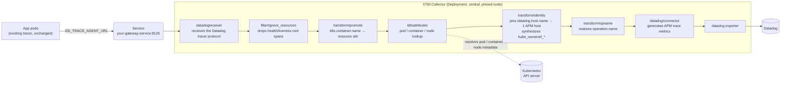

# OTel Trace Gateway

English | [한국어](README.ko.md)

A central [OpenTelemetry Collector](https://opentelemetry.io/docs/collector/) deployment that
speaks the Datadog tracer protocol, so instrumented apps just point
`DD_TRACE_AGENT_URL` at it — no re-instrumentation. It pins every span to one
APM hostname, decoupling Datadog's per-host APM billing from how many pods and
nodes your workloads fan out across.

Environment-specific names and paths are left as `<...>` placeholders.

## 1. The problem

### How APM host billing works

Datadog APM bills **per hostname that submits traces**. On the High Watermark
Plan, it records the number of concurrent hosts every hour, and at month end
bills on the **9th-highest** value sorted descending — the **top 8 hours each
month are free**.

This is not p99: a rare spike costs nothing, a spike that repeats costs the
full amount.

> Fargate is a different model: **average** concurrent task count for the
> month, at a flat rate (not watermark). This can favor bursty, short-lived
> workloads.

### Why short-lived workloads blow this up

With standard node-local collection, a pod reports to its own node's agent.
So **every node a pod has ever landed on becomes an APM host** for that hour.

A workload that runs one pod per task on an autoscaling node pool is the
worst case for this — host count tracks pod/node churn directly, and rises
proportionally with usage.

### The fix

Submit every span under **one fixed hostname**, and host count decouples
from workload fan-out entirely. A central gateway does that.

## 2. Why a Datadog Agent won't work as the gateway

Standing up the gateway as a Datadog Agent is the first thing that comes to
mind. **It doesn't work.**

The Datadog Agent's tagger **only reads pods from its own node's kubelet.**
There's no path to resolving metadata for pods running on other nodes, and no
config flag routes around it. The Cluster Agent only enriches what was
collected locally.

The result: agent tags like `pod_name`, `container_id`, `kube_namespace`
disappear entirely. You can revive them via `DD_TAGS`, but they land as
**span attributes** (`@pod_name`), which don't match existing
queries/dashboards built on the native tags.

### Why an OTel Collector works

The `k8sattributes` processor queries the **Kubernetes API server directly**
instead of a node-local tagger. Pod identity resolves regardless of which
node it's on, and those resource attributes map to **native Datadog tags**.

`datadogreceiver` accepts the Datadog tracer protocol (v0.3/0.4/0.5) as-is, so
**applications need no re-instrumentation.** Only `DD_TRACE_AGENT_URL`
changes.

## 3. Architecture



## 4. What survives and what doesn't

**Restored as native Datadog tags**
`pod_name` `kube_namespace` `kube_deployment` `kube_replica_set`
`container_id` `kube_container_name` `image_name` `image_tag` `zone`
`region`, plus cluster-wide tags injected via `host_metadata.tags`.

**Recovered as span attributes (`@` prefix)**
`@host.type` `@karpenter_nodepool` `@k8s.node.name` `@k8s.pod.uid`
`@kube_ownerref_kind` `@kube_ownerref_name`

**Permanently lost — structural, not a gap in this chart**
`dd_resource_key` (the APM→EC2 instance pivot), `security-group`,
`iam_profile`, launch template tags, `aws_account`, `pod_phase`, `kube_qos`.

Host-level tags are joined **at query time, by hostname.** Pinning the
hostname is the mechanism the savings come from. **You cannot have both a
capped host count and host-entity tags.** This is a trade-off, not a missing
feature — decide up front whether you can live with the loss.

## 5. Collector config — 4 things that are easy to miss

Each one breaks differently if skipped, and some break **silently**.

### 5.1 `transform/opname` — restore the operation name

```yaml
transform/opname:
  trace_statements:
    - set(span.attributes["operation.name"], span.name) where span.attributes["operation.name"] == nil
```

**If skipped**: the exporter recomputes the operation name from span kind
(`express.request` → `Internal`, or `<scope>.<kind>` under v1 logic). The
**`trace.<op>.hits`** metric name changes with it, breaking every monitor,
SLO, and dashboard keyed on it.

`operation.name` wins over both naming modes.

### 5.2 `transform/promote` — container-tier precondition

```yaml
transform/promote:
  trace_statements:
    - set(resource.attributes["k8s.container.name"], span.attributes["k8s.container.name"]) where span.attributes["k8s.container.name"] != nil
```

**If skipped**: `container_id`, `image_name`, `image_tag` are empty.

`k8sattributes` needs `container.id` or `k8s.container.name` as a **resource**
attribute to attach container tags, but the value workloads ship via
`DD_TAGS` arrives as a **span** attribute. It has to be promoted **before**
`k8sattributes` runs.

> A pod IP identifies a pod, but not **which container inside it** emitted
> the span — so the container name is the one thing the workload has to
> supply itself.

### 5.3 `extract.labels` + `from: node` — recover node facts

You lose host-entity tags, but **most of them still live as node labels.**

```yaml
k8sattributes:
  extract:
    labels:
      - { tag_name: host.type,               key: node.kubernetes.io/instance-type, from: node }
      - { tag_name: cloud.availability_zone, key: topology.kubernetes.io/zone,      from: node }
      - { tag_name: cloud.region,            key: topology.kubernetes.io/region,    from: node }
```

`cloud.availability_zone` / `cloud.region` map to the **native `zone` /
`region`** tags. Autoscaler-applied labels (node pool, node group, etc.) can
be pulled the same way.

### 5.4 `datadog/connector` — APM metrics

```yaml
connectors:
  datadog/connector:
    traces:
      compute_stats_by_span_kind: true
      peer_tags_aggregation: true

service:
  pipelines:
    traces:
      exporters: [datadog/connector, datadog]
    metrics:
      receivers: [datadog/connector]
      exporters: [datadog]
```

**If skipped, APM trace metrics are never generated.** The collector logs a
warning at startup, but it's easy to miss.

### 5.5 `IsRootSpan()` guard on the resource filter

To stay in step with a node agent's `DD_APM_IGNORE_RESOURCES`, you need the
same patterns in the Collector too — and **`IsRootSpan()` is required.**

```yaml
filter/ignore_resources:
  error_mode: ignore
  traces:
    span:
      - IsRootSpan() and IsMatch(span.attributes["dd.span.Resource"], "^GET$")
```

The node agent only checks the **root** span's resource and drops the whole
trace on a match; a filter processor runs on **every** span. Without the
guard, a pattern like `^GET$` also deletes ordinary child spans — a redis
`GET`, a cache `GET`, an outbound `GET` — potentially tens of thousands a day
for one service.

`datadogreceiver` puts the Datadog resource name into the
**`dd.span.Resource`** attribute.

> **Not quite identical.** The node agent drops the entire trace; this drops
> the matching root and leaves its children. Matching trace-for-trace would
> need `tail_sampling` plus load-balancing across replicas — a much bigger
> change than the noise it removes.

### 5.6 Pinning the hostname and shared tags

```yaml
transform/identity:
  trace_statements:
    - set(resource.attributes["datadog.host.name"], "<gateway-hostname>")

exporters:
  datadog:
    hostname: "<gateway-hostname>"
    host_metadata:
      enabled: true              # required for tags below to land as native host tags
      hostname_source: config_or_system
      tags: ["<key>:<value>", ...]
```

Pinning `datadog.host.name` is **what caps the host count at 1**.
`host_metadata.tags` backfills what node EC2 tags used to provide — put only
values that are the **same across the whole cluster** here.

## 6. Helm chart layout

| File | Role |
|---|---|
| `Chart.yaml` | `appVersion` tracks the Collector version |
| `values.yaml` | environment-agnostic defaults |
| `templates/configmap.yaml` | the full Collector config |
| `templates/deployment.yaml` | `checksum/config` annotation → auto-rolls on config change |
| `templates/rbac.yaml` | ServiceAccount + ClusterRole for `k8sattributes` |
| `templates/externalsecret.yaml` | pulls the API key from a secret store |
| `templates/service.yaml` | the DNS name workloads point at |
| `templates/hpa.yaml`, `pdb.yaml` | autoscaling / disruption budget |

This repo uses [External Secrets Operator](https://external-secrets.io/) to
pull the Datadog API key from a `ClusterSecretStore`; swap
`templates/externalsecret.yaml` for a plain `Secret` if you don't run ESO.

### Required RBAC

```yaml
rules:
  - apiGroups: [""]
    resources: ["pods", "namespaces", "nodes"]
    verbs: ["get", "list", "watch"]
  - apiGroups: ["apps"]
    resources: ["replicasets"]
    verbs: ["get", "list", "watch"]
```

This read access is the entire reason the gateway can tag pods on other
nodes.

### Placement and scheduling

- **Run it as its own deployable unit.** Bundling it into a shared
  monitoring stack means a gateway outage drags the whole stack down with it.
- **Pin it to stable nodes, not autoscaled ones.** On nodes that get
  recycled, the gateway's hostname keeps changing, which defeats the whole
  point.
- A required `podAntiAffinity` on hostname means **replica count can't
  exceed the number of eligible nodes** — size HPA `maxReplicas` accordingly.
- `pod_association` uses `from: connection` (TCP source IP) — Datadog
  protocol payloads carry no `k8s.pod.ip` resource attribute.

### Health checks

Enable the Collector's `health_check` extension and wire it to the readiness
/ liveness probes — more accurate than a plain TCP check on the trace port.

## 7. Rolling workloads onto the gateway — a route, not a flag

Add a **destination choice** to your shared application chart rather than an
on/off flag:

```yaml
components:
  <component>:
    datadog:
      apm:
        route: gateway     # gateway | node (default: node)
```

Resolved **component → release/cluster → `node`** (default), in that order.

| Case | Result |
|---|---|
| Only the component sets `gateway` | only that component moves |
| Cluster default is `gateway` | everything moves |
| Default `gateway`, one component sets `node` | only that component stays node-local |
| Invalid value | **render fails** (never silently falls back to node-local) |

### Why not a plain on/off flag

`enabled: true` can only express "send to the gateway" — its absence means
node-local. That's fine while the gateway is the exception, but once most
workloads have moved and you want to **flip the default**, a boolean gives
you no way back for the one workload that still needs the APM→host pivot.

### What it renders

```yaml
- name: DD_TRACE_AGENT_URL
  value: "http://<gateway-service>:8126"
- name: DD_TAGS
  value: "k8s.container.name:<component>"
```

**The workload supplies exactly one thing** — its container name. Everything
else is resolved by the gateway from the Kubernetes API.

### Verify the opt-in is strict

With no `route` set, **nothing should render.** That keeps the pod template
hash unchanged for un-migrated workloads, so they don't restart for no
reason.

Don't assume it — check: render the whole app set with the **old and new
chart, same pinned values**, and diff. Comparing values too lets deploy
automation's image-tag drift produce false positives.

Wire this into all four workload kinds — `deployment`, `rollout`,
`cronjob`, `job`. Short-lived task workloads are the **primary target** of
this whole pattern, so skipping `cronjob`/`job` misses the point.

## 8. Rollout procedure

1. Deploy the Collector chart — pinned nodes, its own deployable unit
2. Verify the API key secret wiring
3. Add the `route` field to the shared chart; define the gateway URL once as
   a cluster-wide value
4. Pilot on **one real, low-traffic workload**
5. Verify, then expand workload by workload

### Picking a pilot

- A real production workload, but **low traffic** — enough to validate,
  little at risk
- One that emits **real application spans**, not just health checks
- Child spans / outbound calls help validate the filter guard
- **Avoid isolated namespaces** — a workload behind a NetworkPolicy that
  blocks in-cluster egress conflicts with that isolation's whole intent if
  you route it through the gateway

### What to verify

| Check | Expected |
|---|---|
| `host` | the gateway's hostname |
| Container tags | `container_id`, `kube_container_name`, `image_name`, `image_tag` all native |
| Operation name | unchanged from before |
| APM metrics | `trace.<op>.hits` generated under the existing name |
| Child spans | preserved |

**Rollback** is removing `route`, or setting it to `node`. Takes effect on
the next pod restart.

## 9. Operational notes

- **Keep filter patterns in sync with the node agent's.** If only one side
  changes, the same app gets filtered differently depending on its route.
- **Validate Collector config changes against the image.** A config error
  only shows up as a startup failure.

  ```shell
  docker run --rm -e DD_API_KEY=dummy -v <rendered-config>:/conf/config.yaml:ro \
    ghcr.io/open-telemetry/opentelemetry-collector-releases/opentelemetry-collector-contrib:<version> \
    validate --config=/conf/config.yaml
  ```

- You can also verify filter behavior directly — run the Collector locally,
  attach a `debug` exporter, send a payload, and see exactly what passes and
  what gets dropped.
- **This is meaningless if Datadog isn't your trace backend.**

## 10. Check the cost math before you build this

Before adopting this, measure **what's actually driving the bill.**
Aggregating the distinct `host` values on your spans by hour gives a rough
approximation.

If the top hourly values cluster around a **repeating batch job**, reshaping
that batch's schedule can capture more of the savings, more cheaply, than the
gateway. Since the top 8 hours/month are free, collapsing frequent short
bursts into rare, large ones can drive that cost to zero.

That said, it ties your batch schedule to an observability cost concern, and
it stops scaling once short-lived workload count grows. **The gateway is the
structural fix.** The two aren't mutually exclusive.

## References

- [APM billing](https://docs.datadoghq.com/account_management/billing/apm_tracing_profiler/) — HWM, the 9th-highest hour. Fargate is billed on a monthly average instead
- [Operation name mapping migration](https://docs.datadoghq.com/opentelemetry/migrate/migrate_operation_names/) — why `operation.name` takes priority
- [OTel semantic mapping](https://docs.datadoghq.com/opentelemetry/schema_semantics/semantic_mapping/) — resource attributes → native Datadog tags
- [Hostname and tagging](https://docs.datadoghq.com/opentelemetry/config/hostname_tagging/) · [Hostname resolution](https://docs.datadoghq.com/opentelemetry/schema_semantics/hostname/)
- [`k8sattributes` processor](https://github.com/open-telemetry/opentelemetry-collector-contrib/blob/main/processor/k8sattributesprocessor/README.md) — container attribute requirements, `from: node`
- [`datadogreceiver`](https://github.com/open-telemetry/opentelemetry-collector-contrib/blob/main/receiver/datadogreceiver/README.md) — why existing tracers need no re-instrumentation
- [Collector deployment patterns](https://docs.datadoghq.com/opentelemetry/setup/collector_exporter/deploy/) — the empty Traces cell for "gateway" in that table refers to a topology with **no node agent in front**, which differs from the one used here
